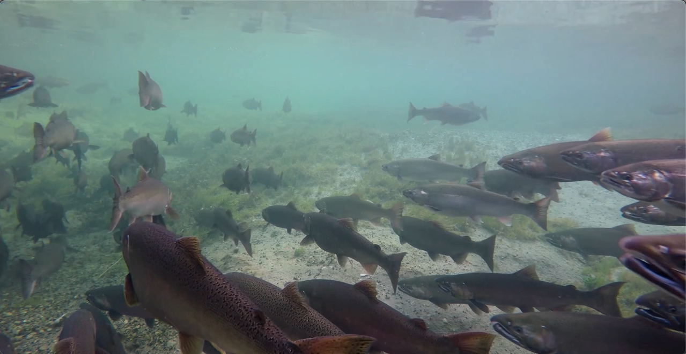
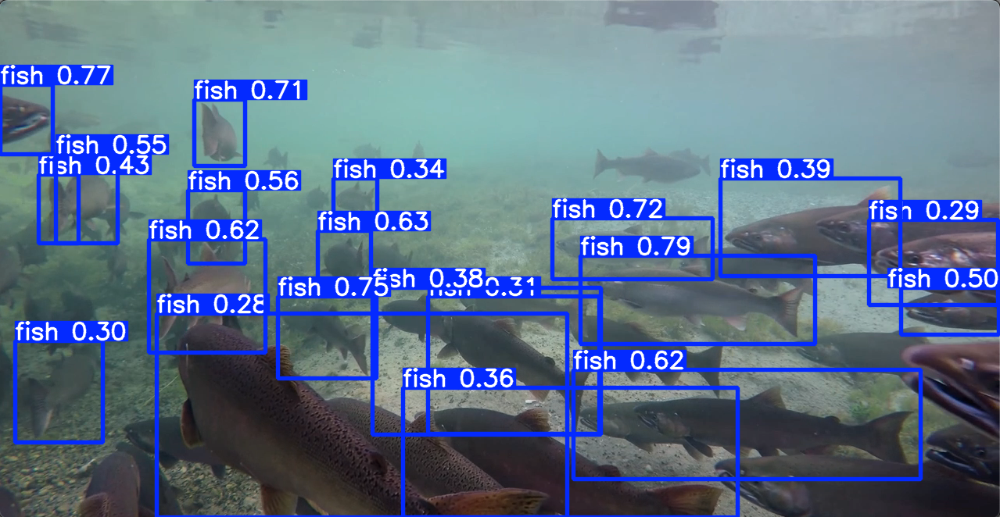
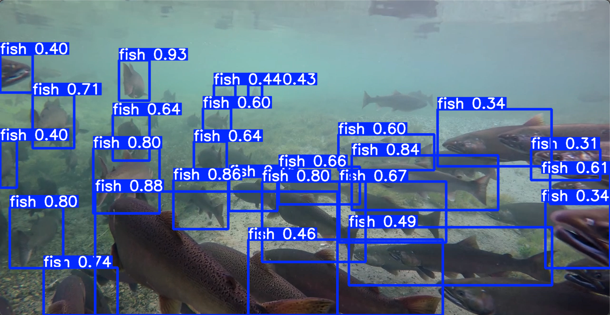
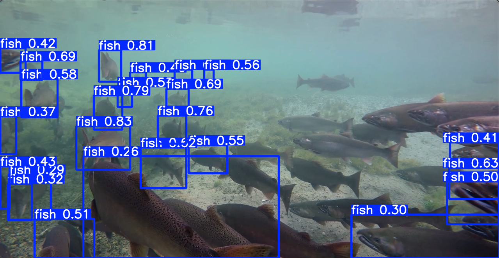
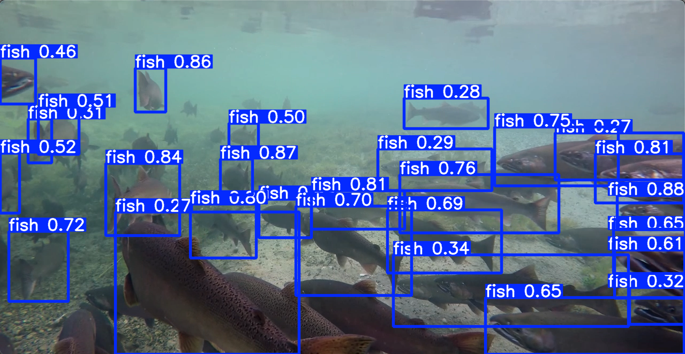
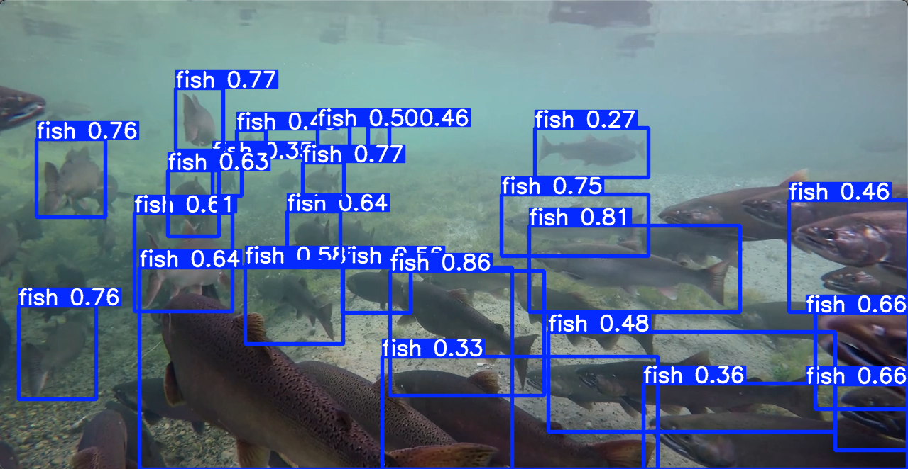

# Model Comparison (YOLO)

This folder contains code and results for comparing multiple YOLO models on the Aquarium dataset.

---

## Contents

| File | Description |
|------|-------------|
| `yolo_5models_comparison_training_resume.py` | Training script with resume/skip logic |
| `evaluation_results.csv` | Summary metrics (mAP, Precision, Recall, F1) |
| `ds_aquarium_combined.ipynb` | Dataset inspection and preparation notebook |
| `configs/data.yaml` | Dataset configuration for Ultralytics YOLO |
| `inference_images/` | Sample inference visualizations |

---

## Dataset Preprocessing and Class Merging

The original Roboflow Aquarium dataset provides multiple object classes:

- fish, shark, stingray
- jellyfish, penguin, puffin, starfish

For this study, a **single-class detection setup** was adopted. Annotations belonging to `fish`, `shark`, and `stingray` were merged into one unified class labeled `fish`. All other classes were discarded.

This simplifies the task to **generic fish detection**, aligning with downstream application requirements.

---

## Models Compared

- yolo11m.pt
- yolo11n.pt
- yolo11s.pt
- yolov8m.pt
- yolov8_OzFish+AquaCoop.pt

## Model Performance Comparison

| Model                  | mAP50-95   | mAP50      | Precision | Recall   | F1-Score  |
|------------------------|------------|------------|-----------|----------|-----------|
| YOLO11m                | 0.4657     | **0.8097** | **0.8117**| 0.6866   |0.7439     |
| YOLO11n                | 0.3595     | 0.6977     | 0.7255    | 0.6102   | 0.6629    |
| YOLO11s                | 0.4703     | 0.7499     | 0.7763    | 0.6588   | 0.7127    |
| YOLOv8m                | **0.4846** | 0.7901     | 0.7837    |**0.7356**|**0.7589** |
| YOLOv8 OzFish+AquaCoop | 0.3570     | 0.6740     | 0.7421    | 0.6048   | 0.6664    |

## Inference comparison

| Original | YOLO11m | YOLO11n |
|----------|---------|---------|
|  |  |  |
| YOLO11s | YOLOv8m | YOLOv8 OzFish + AquaCoop |
|  |  |  |

**Notes**
- Metrics are computed on the same validation set.
- Results are summarized in `evaluation_results.csv`.


## How to run training

From the repository root:

```bash
python model_comparison/yolo_5models_comparison_training_resume.py

